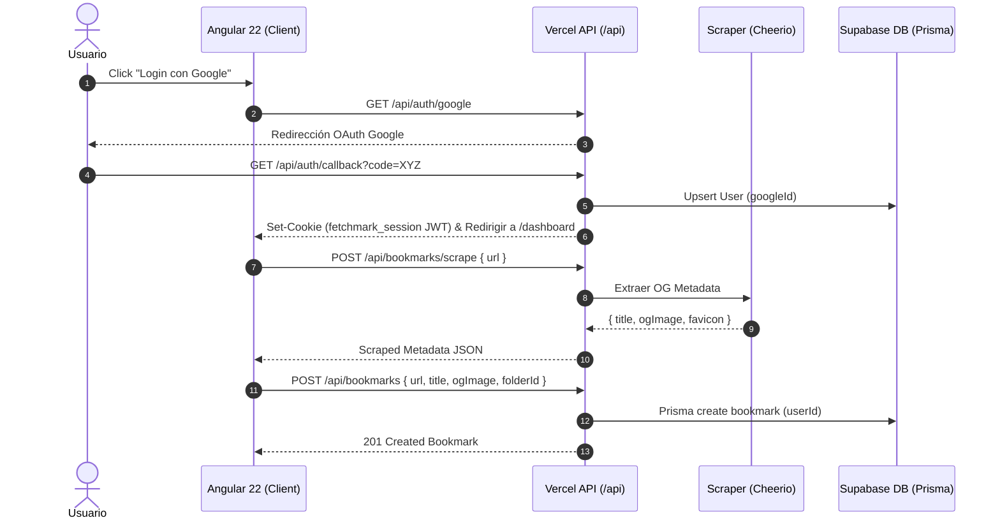

# Diseño Técnico: fetchmark-v2

## 1. Enfoque Técnico y Decisiones de Arquitectura
- **Topología Híbrida**: Frontend en Angular 22 (SSR + Signals) con Backend en Vercel Serverless Functions exclusivamente en `/api/*` aisladas mediante `vercel.json` para evitar colisiones con el enrutador de Angular.
- **Persistencia Serverless**: PostgreSQL en Supabase gestionado con Prisma ORM. Consultas en ejecución serverless mediante Supavisor Connection Pooler (`DATABASE_URL`, puerto 6543, modo transacción, `connection_limit=1`), y migraciones DDL mediante conexión directa (`DIRECT_URL`, puerto 5432).
- **Autenticación**: Google OAuth 2.0. Sesión persistida mediante JWT firmado en cookie `fetchmark_session` con banderas `HttpOnly`, `Secure` (en prod), y `SameSite=Lax`.
- **Scraping OpenGraph**: Extracción asíncrona de metadatos (título, descripción, og:image, favicon) mediante Cheerio en `/api/bookmarks/scrape`.

## 2. Flujo de Datos


## 3. Configuración Tailwind CSS (`tailwind.config.ts`)
```typescript
import type { Config } from 'tailwindcss';

export default {
  content: ['./src/**/*.{html,ts}'],
  theme: {
    extend: {
      colors: {
        brand: {
          50: '#eef2ff',
          100: '#e0e7ff',
          500: '#6366f1',
          600: '#4f46e5',
          700: '#4338ca',
        },
        surface: {
          base: '#f8fafc',
          card: '#ffffff',
          overlay: 'rgba(15, 23, 42, 0.6)',
          sidebar: '#f1f5f9',
        },
      },
      fontFamily: {
        sans: ['Inter', 'Plus Jakarta Sans', 'sans-serif'],
      },
      animation: {
        'fade-in': 'fadeIn 0.2s cubic-bezier(0.16, 1, 0.3, 1)',
        'slide-up': 'slideUp 0.3s cubic-bezier(0.16, 1, 0.3, 1)',
        'pulse-subtle': 'pulseSubtle 1.5s infinite ease-in-out',
      },
      keyframes: {
        fadeIn: { '0%': { opacity: '0' }, '100%': { opacity: '1' } },
        slideUp: { '0%': { opacity: '0', transform: 'translateY(8px)' }, '100%': { opacity: '1', transform: 'translateY(0)' } },
        pulseSubtle: { '0%, 100%': { opacity: '1' }, '50%': { opacity: '0.4' } },
      },
    },
  },
  plugins: [],
} satisfies Config;
```

## 4. Diccionario de Tokens UI
| Categoría | Token Semántico | Clase Tailwind | Uso / Aplicación |
| :--- | :--- | :--- | :--- |
| **Surfaces** | `surface-base` | `bg-slate-50 dark:bg-slate-900` | Fondo general de la aplicación |
| | `surface-card` | `bg-white dark:bg-slate-800 border border-slate-200/80` | Tarjetas de marcadores y contenedores |
| | `surface-sidebar` | `bg-slate-100/70 dark:bg-slate-900/50` | Panel lateral de navegación de carpetas |
| | `surface-overlay` | `bg-slate-950/40 backdrop-blur-sm` | Fondo atenuado de modales |
| **Typography** | `text-primary` | `text-slate-900 dark:text-slate-100 font-medium` | Títulos y texto principal |
| | `text-secondary` | `text-slate-600 dark:text-slate-400` | Metadatos y descripciones de marcadores |
| | `text-muted` | `text-slate-400 dark:text-slate-500 text-xs` | Fechas, dominios y subtítulos secundarios |
| | `text-brand` | `text-indigo-600 dark:text-indigo-400 font-semibold` | Elementos activos y acentos de marca |
| **Interacciones**| `state-hover` | `hover:bg-slate-100 hover:text-indigo-600` | Estado hover en items de menú y botones |
| | `state-focus` | `focus-visible:ring-2 focus-visible:ring-indigo-500` | Enfoque de accesibilidad por teclado |
| | `state-active` | `active:scale-[0.98] transition-transform` | Feedback táctil al hacer clic |
| | `state-disabled` | `disabled:opacity-50 disabled:cursor-not-allowed` | Elementos inactivos o deshabilitados |
| **Skeletons** | `skeleton-base` | `bg-slate-200 dark:bg-slate-700 animate-pulse-subtle rounded-md` | Placeholder de carga de marcadores |
| **Empty States** | `empty-container` | `flex flex-col items-center justify-center p-8 text-center` | Estado sin marcadores o carpetas |

## 5. Microinteracciones y Reglas de Layout
- **Microinteracciones en Tarjetas de Marcadores**:
  - Elevación al hover: `transition-all duration-200 ease-out hover:-translate-y-1 hover:shadow-xl hover:ring-1 hover:ring-black/5 dark:hover:ring-white/10`.
  - Revelado de acciones mediante grupo: El contenedor de la tarjeta utiliza la clase `group`. Las acciones (editar/eliminar) aplican `opacity-0 group-hover:opacity-100 transition-opacity duration-150`.
- **Layout Masonry Dinámico / Grid Fluido**:
  - Rejilla adaptativa CSS Grid: `grid grid-cols-1 sm:grid-cols-2 lg:grid-cols-3 xl:grid-cols-4 gap-4 auto-rows-max`.
  - Ajuste de contenido reactivo: Las tarjetas usan `break-inside-avoid flex flex-col h-full` para garantizar una alineación uniforme de imágen OpenGraph, favicon y acciones sin romper el flujo vertical.

## 6. Cambios en Archivos e Interfaces
- `api/auth/*.ts`: Functions de Google OAuth2 y emisión JWT.
- `api/bookmarks/*.ts` & `api/folders/*.ts`: CRUD serverless e integración con Scraper Cheerio.
- `api/lib/prisma.ts`: Instancia Singleton PrismaClient con pooler.
- `src/app/core/services/*.ts`: Servicios Angular con Signals (`auth.service`, `bookmark.service`, `folder.service`).
- `src/app/components/organisms/bookmark-grid/`: Grid con layout fluido y microinteracciones.

### Interfaces Principales (`src/app/core/models/index.ts`)
```typescript
export interface User { id: string; email: string; name?: string; avatarUrl?: string; }
export interface Bookmark { id: string; title: string; url: string; description?: string; ogImage?: string; favicon?: string; folderId?: string; userId: string; createdAt: string; }
export interface Folder { id: string; name: string; color?: string; icon?: string; parentId?: string; userId: string; children?: Folder[]; }
export interface ScrapedMetadata { title: string; description?: string; ogImage?: string; favicon?: string; }
```

## 7. Estrategia de Pruebas
- **Unidad**: Jasmine/Karma para componentes Angular y servicios Signals (`BookmarkService`, `AuthService`).
- **Integración API**: Pruebas sobre endpoints `/api/*` mediante Supertest mockeando Prisma Client.
- **E2E**: Playwright para flujos de Login OAuth2 (mock token), creación de marcador con scraping y navegación de carpetas.

## 8. Matriz de Amenazas y Seguridad
| Amenaza | Riesgo | Mitigación |
| :--- | :--- | :--- |
| **CSRF / State Spoofing** | Alto | Parámetro `state` criptográfico en OAuth y cookie `SameSite=Lax; HttpOnly`. |
| **SSRF en Scraper** | Crítico | Validación de protocolo (`http/https`) y desestimación de IPs privadas (`127.0.0.1`, `10.x.x.x`). |
| **Inyección SQL** | Alto | Consultas parametrizadas nativas mediante Prisma ORM. |
| **Stored XSS** | Medio | Escapado automático de plantillas Angular e higienización de títulos/descripciones scrapeadas. |
| **Agotamiento Conexiones DB** | Alto | Uso exclusivo de Supavisor Pooler (puerto 6543, `connection_limit=1`). |

## 9. Plan de Migración y Despliegue
1. **Migración DB**: Ejecutar `npx prisma migrate deploy` usando `DIRECT_URL` (puerto 5432).
2. **Variables de Entorno**: Configurar `DATABASE_URL` (6543), `DIRECT_URL` (5432), `JWT_SECRET`, `GOOGLE_CLIENT_ID`, `GOOGLE_CLIENT_SECRET` en Vercel.
3. **Despliegue Vercel**: Compilar frontend Angular SSR y desplegar Serverless Functions bajo `/api/*`.
4. **Verificación**: Probar salud de `/api/auth/me` y creación de marcadores con scraping.

## 10. Preguntas Abiertas
- Ninguna.
