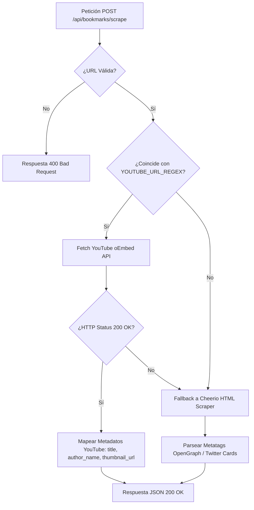

# Diseño Técnico: fetchmark-v3

## 1. Enfoque Técnico y Decisiones de Arquitectura

`fetchmark-v3` establece un rediseño UI **Mobile-First Light Theme**, la introducción de una **Landing Page de captación pública** y la optimización del motor de scraping mediante **YouTube oEmbed API** con fallback resiliente.

### Decisiones Clave
1. **Light Theme por Defecto**: Paleta visual clara basada en `slate` (`bg-slate-50` para fondo, `bg-white` para tarjetas) con acento `indigo-600`.
2. **Jerarquía Única de Acción Primaria**:
   - **Header**: Único botón primario destacado (`+ Nuevo Marcador`).
   - **Sidebar**: Icono minimalista `+` al lado de "Carpetas" sin competir en peso visual.
3. **Accesibilidad Mobile-First sin Hover**:
   - Eliminación de dependencias `:hover` / `group-hover` para transacciones operativas.
   - Menú Kebab (`⋮`) accesible táctilmente (`min-w-[44px] min-h-[44px]`) presente de forma continua en tarjetas de marcadores.
4. **Enrutamiento y Landing Page**: Ruta pública `/` (`LandingComponent`) protegida con `GuestGuard` que redirige a `/dashboard` si el usuario está autenticado.
5. **Scraper Resiliente Híbrido**: Detección de enlaces de YouTube mediante expresiones regulares (`YOUTUBE_URL_REGEX`), consulta condicional a la API oEmbed de YouTube y fallback automático a Cheerio.

---

## 2. Configuración de Tema Tailwind (`tailwind.config.ts`)

```typescript
import type { Config } from 'tailwindcss';

export default {
  content: ['./src/**/*.{html,ts}'],
  theme: {
    extend: {
      colors: {
        brand: {
          50: '#eef2ff',
          100: '#e0e7ff',
          500: '#6366f1',
          600: '#4f46e5',
          700: '#4338ca',
        },
        surface: {
          base: '#f8fafc',
          card: '#ffffff',
          sidebar: '#ffffff',
          overlay: 'rgba(15, 23, 42, 0.5)',
        }
      },
      fontFamily: {
        sans: ['Inter', 'Plus Jakarta Sans', 'system-ui', 'sans-serif'],
      },
      boxShadow: {
        'card-hover': '0 20px 25px -5px rgba(0, 0, 0, 0.1), 0 8px 10px -6px rgba(0, 0, 0, 0.1)',
      },
      animation: {
        'fade-in': 'fadeIn 0.2s cubic-bezier(0.16, 1, 0.3, 1)',
        'slide-up': 'slideUp 0.3s cubic-bezier(0.16, 1, 0.3, 1)',
      },
      keyframes: {
        fadeIn: { '0%': { opacity: '0' }, '100%': { opacity: '1' } },
        slideUp: { '0%': { opacity: '0', transform: 'translateY(8px)' }, '100%': { opacity: '1', transform: 'translateY(0)' } },
      }
    },
  },
  plugins: [],
} satisfies Config;
```

---

## 3. Diccionario de Tokens UI

| Categoría | Elemento | Clases / Tokens Tailwind | Propósito / Uso |
| --- | --- | --- | --- |
| **Layout** | Fondo Principal | `bg-slate-50 text-slate-900 min-h-screen` | Superficie global en modo claro |
| **Layout** | Grid Marcadores | `grid grid-cols-1 sm:grid-cols-2 lg:grid-cols-3 xl:grid-cols-4 gap-6` | Disposición responsiva de tarjetas |
| **Surfaces** | Tarjeta Marcador | `bg-white border border-slate-200 rounded-xl shadow-sm hover:shadow-xl hover:-translate-y-1 ring-1 ring-black/5 transition-all` | Contenedor principal de marcadores |
| **Surfaces** | Sidebar / Nav | `bg-white border-r border-slate-200` | Panel lateral de navegación |
| **Surfaces** | Overlay Modal | `bg-slate-900/50 backdrop-blur-sm` | Fondo oscurecido para modales |
| **Buttons** | Primario Header | `bg-indigo-600 hover:bg-indigo-700 text-white font-medium px-4 py-2 rounded-lg shadow-sm focus:ring-2 focus:ring-indigo-500` | Acción principal "Nuevo Marcador" |
| **Buttons** | Secundario | `bg-white border border-slate-300 text-slate-700 hover:bg-slate-50 px-3 py-1.5 rounded-lg` | Cancelar y acciones secundarias |
| **Buttons** | Minimalista Sidebar | `p-1 text-slate-400 hover:text-slate-600 rounded-md hover:bg-slate-100` | Icono "+" en sección Carpetas |
| **Kebab Menu** | Trigger Button | `p-2 text-slate-500 hover:text-slate-700 active:bg-slate-100 rounded-full touch-manipulation min-w-[44px] min-h-[44px]` | Botón táctil permanente `⋮` |
| **Kebab Menu** | Dropdown Menu | `absolute right-0 mt-2 w-48 bg-white rounded-lg shadow-lg ring-1 ring-black/5 divide-y divide-slate-100 z-20` | Menú desplegable táctil de acciones |
| **Landing Hero** | Titular Principal | `text-4xl sm:text-5xl font-extrabold text-slate-900 tracking-tight` | Título llamativo en la Landing Page |
| **Landing Hero** | Subtítulo | `text-lg text-slate-600 max-w-2xl mx-auto` | Descripción de valor |
| **Landing Hero** | CTA Hero | `bg-indigo-600 hover:bg-indigo-700 text-white text-lg font-semibold px-8 py-3.5 rounded-xl shadow-lg transition-all` | Botón de conversión principal |
| **Skeletons** | Card Skeleton | `bg-slate-200 animate-pulse rounded-lg` | Placeholder mientras carga |
| **Typography** | Título Tarjeta | `font-semibold text-slate-900 hover:text-indigo-600 line-clamp-2` | Título del enlace |
| **Typography** | Texto Meta | `text-xs text-slate-500 font-medium` | Dominio / Autor / Fecha |
| **Interaction** | Desktop Micro-interaction | `transition-all duration-200 hover:-translate-y-1 hover:shadow-xl` | Elevación sutil en desktop |
| **Empty States** | State Container | `flex flex-col items-center justify-center p-12 text-center bg-white rounded-xl border border-dashed border-slate-300` | Vista para sin marcadores |

---

## 4. Reglas de Maquetación Grid / Masonry Dinámico

- **Grid Fluido Adaptable**: La vista de marcadores utiliza CSS Grid con reglas de expansión dinámica:
  ```css
  .bookmark-grid {
    display: grid;
    grid-template-columns: repeat(auto-fill, minmax(280px, 1fr));
    gap: 1.5rem;
    align-items: start;
  }
  ```
- **Contención de Miniaturas**: Las miniaturas de tarjetas mantienen relación de aspecto `aspect-video` con `object-cover` para evitar descalces visuales entre tarjetas de distinto origen (YouTube vs sitios estándar).

---

## 5. Diagrama de Flujo de Datos (YouTube oEmbed Scraper)



---

## 6. Tabla de Cambios en Archivos

| Archivo | Acción | Descripción |
| --- | --- | --- |
| `src/styles.css` | Modificar | Actualización de tokens Tailwind v4 a paleta Light Theme por defecto. |
| `tailwind.config.ts` | Crear/Modificar | Configuración de tema extendido (colores `brand`, fuentes y animaciones). |
| `src/app/app.routes.ts` | Modificar | Integración de rutas para Landing Page `/`, `/dashboard` y guardias `GuestGuard`/`AuthGuard`. |
| `src/app/features/landing/landing.component.ts` | Crear | Vista Landing Page pública con Hero Section, Features y CTA. |
| `src/app/components/molecules/bookmark-actions-menu/` | Crear | Componente menú Kebab (`⋮`) táctil accesible con `signal`. |
| `src/app/components/molecules/bookmark-card/` | Modificar | Integración del menú Kebab permanente y eliminación de dependencias `group-hover`. |
| `api/extract-metadata.ts` | Modificar | Lógica de scraping con regex de YouTube, consulta oEmbed y fallback Cheerio. |

---

## 7. Contratos e Interfaces TypeScript

### 7.1 Componente `BookmarkActionsMenuComponent`
```typescript
@Component({
  selector: 'app-bookmark-actions-menu',
  standalone: true,
  templateUrl: './bookmark-actions-menu.component.html',
})
export class BookmarkActionsMenuComponent {
  @Input({ required: true }) bookmarkId!: string;
  @Input() isOwner: boolean = true;
  @Output() edit = new EventEmitter<string>();
  @Output() delete = new EventEmitter<string>();

  isOpen = signal<boolean>(false);
  toggleMenu(event: Event): void { event.stopPropagation(); this.isOpen.update(v => !v); }
  closeMenu(): void { this.isOpen.set(false); }
}
```

### 7.2 API de Scraping (`/api/bookmarks/scrape`)
```typescript
export interface ScrapeRequest {
  url: string;
}

export interface MetadataResponse {
  title: string;
  description: string;
  image: string | null;
  siteName: string | null;
  url: string;
}
```

---

## 8. Estrategia de Pruebas y Matriz de Amenazas

### Pruebas Unitarias y E2E
- **Menú Kebab**: Verificación de evento `tap`/`click` en pantallas táctiles y cierre con overlay.
- **Scraper YouTube oEmbed**: Test unitario con URL válida de YouTube mockeando respuesta oEmbed status 200 y status 404 (para validar fallback Cheerio).
- **Guards de Rutas**: Verificación de redirección de usuarios autenticados al acceder a `/`.

### Matriz de Amenazas (Threat Matrix)

| Riesgo / Amenaza | Impacto | Mitigación Arquitectural |
| --- | --- | --- |
| Rate Limit de YouTube oEmbed API | Medio | Fallback automático y transparente al parser HTML Cheerio. |
| Dificultad táctil en móviles por hover | Alto | Eliminación total de dependencias `:hover` para acciones CRUD; menú Kebab táctil de 44x44px. |
| Acceso no autorizado a vistas privadas | Alto | Protección mediante `AuthGuard` en `/dashboard`. |

---

## 9. Migración y Preguntas Abiertas

### Migración
- Migración transparente de las clases CSS oscuras (`bg-slate-900`) a los tokens Light Theme (`bg-slate-50`, `bg-white`).
- Reemplazo de botones de acción flotantes por el componente `BookmarkActionsMenuComponent`.

### Preguntas Abiertas
- ¿Se requiere implementación de almacenamiento en caché serverless (p. ej. Redis/KV) para respuestas de YouTube oEmbed en futuras iteraciones?
