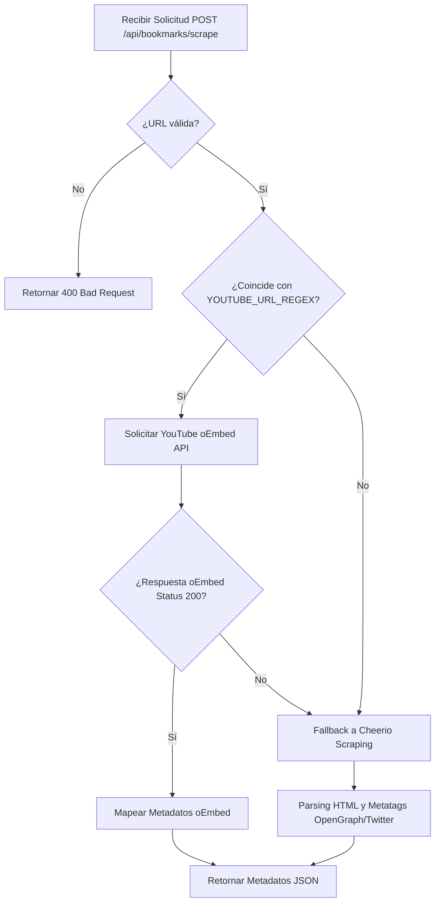

# Especificación Técnica: fetchmark-v3

## Visión General
Esta especificación define los requisitos técnicos, contratos de interfaz y arquitectura para la versión v3 de **FetchMark**. Esta versión introduce un rediseño UI Mobile-First con tema claro activo por defecto, una Landing Page de captación pública, un menú de acciones contextuales Kebab accesible sin hover en móviles y la optimización del motor de scraping mediante YouTube oEmbed API con fallback transparente a Cheerio.

---

## 1. Árbol de Enrutamiento de Angular (Angular Routing Tree)

El enrutamiento de la aplicación se reestructura para dar soporte a la navegación pública (Landing Page) y la navegación privada (Dashboard y gestión de marcadores) mediante guardias de autenticación (`AuthGuard` y `GuestGuard`).

### 1.1 Configuración de Rutas (`app.routes.ts`)

```typescript
import { Routes } from '@angular/router';
import { AuthGuard } from './core/guards/auth.guard';
import { GuestGuard } from './core/guards/guest.guard';

export const routes: Routes = [
  {
    path: '',
    loadComponent: () => import('./features/landing/landing.component').then(m => m.LandingComponent),
    canActivate: [GuestGuard],
    title: 'FetchMark - Guarda y Organiza tus Enlaces'
  },
  {
    path: 'dashboard',
    loadComponent: () => import('./features/dashboard/dashboard.component').then(m => m.DashboardComponent),
    canActivate: [AuthGuard],
    title: 'Dashboard - FetchMark'
  },
  {
    path: 'login',
    loadComponent: () => import('./features/auth/login.component').then(m => m.LoginComponent),
    canActivate: [GuestGuard],
    title: 'Iniciar Sesión - FetchMark'
  },
  {
    path: '**',
    redirectTo: ''
  }
];
```

### 1.2 Estructura del Árbol de Navegación

| Ruta | Componente | Acceso | Guardia | Propósito |
| --- | --- | --- | --- | --- |
| `/` | `LandingComponent` | Público | `GuestGuard` | Landing page estática de captación (Hero, Features, CTA). Redirige a `/dashboard` si el usuario está autenticado. |
| `/dashboard` | `DashboardComponent` | Privado | `AuthGuard` | Panel principal de gestión de marcadores, carpetas y búsqueda. |
| `/login` | `LoginComponent` | Público | `GuestGuard` | Vista de inicio de sesión e integración de Google OAuth. |
| `**` | Redirección | Todos | N/A | Redirección comodín hacia `/` para rutas no encontradas. |

---

## 2. Contrato de Componente: `BookmarkActionsMenu` (Mobile-First Kebab Menu)

Para eliminar la dependencia de `:hover` / `group-hover` de CSS (inadecuada para pantallas táctiles), se implementa un menú Kebab táctil e independiente con toggle modal/dropdown explícito.

### 2.1 Especificación de la Interfaz TypeScript (`bookmark-actions-menu.component.ts`)

```typescript
import { Component, Input, Output, EventEmitter, ChangeDetectionStrategy, signal } from '@angular/core';
import { CommonModule } from '@angular/common';

@Component({
  selector: 'app-bookmark-actions-menu',
  standalone: true,
  imports: [CommonModule],
  templateUrl: './bookmark-actions-menu.component.html',
  styleUrls: ['./bookmark-actions-menu.component.css'],
  changeDetection: ChangeDetectionStrategy.OnPush
})
export class BookmarkActionsMenuComponent {
  /** ID del marcador sobre el cual se realizarán las acciones */
  @Input({ required: true }) bookmarkId!: string;

  /** Indica si el usuario actual tiene permisos de propietario sobre el marcador */
  @Input() isOwner: boolean = true;

  /** Evento emitido al seleccionar la opción de editar */
  @Output() edit = new EventEmitter<string>();

  /** Evento emitido al seleccionar la opción de eliminar */
  @Output() delete = new EventEmitter<string>();

  /** Estado reactivo del dropdown modal (abierto / cerrado) */
  isOpen = signal<boolean>(false);

  /**
   * Alterna la visibilidad del menú contextual al hacer tap/click
   */
  toggleMenu(event: MouseEvent | TouchEvent): void {
    event.stopPropagation();
    this.isOpen.update(prev => !prev);
  }

  /**
   * Cierra el menú desplegable
   */
  closeMenu(): void {
    this.isOpen.set(false);
  }

  /**
   * Maneja la acción de edición
   */
  onEdit(event: MouseEvent | TouchEvent): void {
    event.stopPropagation();
    this.edit.emit(this.bookmarkId);
    this.closeMenu();
  }

  /**
   * Maneja la acción de eliminación
   */
  onDelete(event: MouseEvent | TouchEvent): void {
    event.stopPropagation();
    this.delete.emit(this.bookmarkId);
    this.closeMenu();
  }
}
```

### 2.2 Plantilla HTML Acondicionada para Táctil (`bookmark-actions-menu.component.html`)

```html
<div class="relative inline-block text-left">
  <!-- Botón Kebab ⋮ accesible para pantalla táctil -->
  <button
    type="button"
    aria-label="Opciones del marcador"
    aria-haspopup="true"
    [attr.aria-expanded]="isOpen()"
    (click)="toggleMenu($event)"
    class="p-2 text-slate-500 hover:text-slate-700 active:bg-slate-100 rounded-full focus:outline-none focus:ring-2 focus:ring-indigo-500 touch-manipulation min-w-[44px] min-h-[44px] flex items-center justify-center"
  >
    <svg class="w-5 h-5" fill="currentColor" viewBox="0 0 20 20" xmlns="http://www.w3.org/2000/svg">
      <path d="M10 6a2 2 0 110-4 2 2 0 010 4zM10 12a2 2 0 110-4 2 2 0 010 4zM10 18a2 2 0 110-4 2 2 0 010 4z"/>
    </svg>
  </button>

  <!-- Overlay para cerrar el menú al hacer tap fuera -->
  <div
    *ngIf="isOpen()"
    class="fixed inset-0 z-10 w-full h-full cursor-default"
    (click)="closeMenu()"
    (touchstart)="closeMenu()"
  ></div>

  <!-- Desplegable Contextual -->
  <div
    *ngIf="isOpen()"
    class="absolute right-0 z-20 mt-2 w-48 rounded-md bg-white shadow-lg ring-1 ring-black ring-opacity-5 divide-y divide-slate-100 focus:outline-none transition-all duration-150 ease-out"
    role="menu"
    aria-orientation="vertical"
  >
    <div class="py-1" role="none">
      <button
        type="button"
        *ngIf="isOwner"
        (click)="onEdit($event)"
        class="w-full text-left px-4 py-3 text-sm text-slate-700 hover:bg-slate-50 active:bg-slate-100 flex items-center gap-2 touch-manipulation"
        role="menuitem"
      >
        <svg class="w-4 h-4 text-slate-400" fill="none" stroke="currentColor" viewBox="0 0 24 24">
          <path stroke-linecap="round" stroke-linejoin="round" stroke-width="2" d="M11 5H6a2 2 0 00-2 2v11a2 2 0 002 2h11a2 2 0 002-2v-5m-1.414-9.414a2 2 0 112.828 2.828L11.828 15H9v-2.828l8.586-8.586z"/>
        </svg>
        Editar
      </button>
      
      <button
        type="button"
        *ngIf="isOwner"
        (click)="onDelete($event)"
        class="w-full text-left px-4 py-3 text-sm text-rose-600 hover:bg-rose-50 active:bg-rose-100 flex items-center gap-2 touch-manipulation"
        role="menuitem"
      >
        <svg class="w-4 h-4 text-rose-500" fill="none" stroke="currentColor" viewBox="0 0 24 24">
          <path stroke-linecap="round" stroke-linejoin="round" stroke-width="2" d="M19 7l-.867 12.142A2 2 0 0116.138 21H7.862a2 2 0 01-1.995-1.858L5 7m5 4v6m4-6v6m1-10V4a1 1 0 00-1-1h-4a1 1 0 00-1 1v3M4 7h16"/>
        </svg>
        Eliminar
      </button>
    </div>
  </div>
</div>
```

---

## 3. Reglas de Lógica del Scraper (`/api/bookmarks/scrape` y `/api/extract-metadata`)

El endpoint de extracción de metadatos procesa solicitudes de scraping utilizando una arquitectura híbrida con evaluación de expresiones regulares de YouTube y consulta a oEmbed con fallback transparente a Cheerio.

### 3.1 Expresión Regular para Detección de Dominios de YouTube

```typescript
export const YOUTUBE_URL_REGEX = /^(?:https?:\/\/)?(?:www\.)?(?:m\.)?(?:youtube\.com\/(?:watch\?v=|embed\/|v\/|shorts\/)|youtu\.be\/)([\w-]{11})(?:[\?&].*)?$/i;
```

### 3.2 Flujo de Extracción e Integración YouTube oEmbed



### 3.3 Mapeo de Campos de Respuesta oEmbed

Cuando la llamada a `https://www.youtube.com/oembed?url={URL_ENCODED}&format=json` resulta exitosa, los datos se mapean de la siguiente manera:

| Campo oEmbed de YouTube | Campo de Respuesta de la API FetchMark | Descripción |
| --- | --- | --- |
| `title` | `title` | Título oficial del video de YouTube. |
| `author_name` | `publisher` / `description` | Nombre del canal o creador del contenido. |
| `thumbnail_url` | `image` | URL de la miniatura de alta resolución (`maxresdefault` o `hqdefault`). |
| `provider_name` | `siteName` | Constante `"YouTube"`. |
| N/A | `url` | URL canonical ingresada. |

### 3.4 Implementación del Scraper (`/api/bookmarks/scrape.ts` / `/api/extract-metadata.ts`)

```typescript
import { Request, Response } from 'express';
import cheerio from 'cheerio';

interface MetadataResponse {
  title: string;
  description: string;
  image: string | null;
  siteName: string | null;
  url: string;
}

const YOUTUBE_URL_REGEX = /^(?:https?:\/\/)?(?:www\.)?(?:m\.)?(?:youtube\.com\/(?:watch\?v=|embed\/|v\/|shorts\/)|youtu\.be\/)([\w-]{11})(?:[\?&].*)?$/i;

export async function scrapeMetadataHandler(req: Request, res: Response): Promise<void> {
  const { url } = req.body;

  if (!url || typeof url !== 'string') {
    res.status(400).json({ error: 'Se requiere una URL válida.' });
    return;
  }

  try {
    // 1. Detección e intento oEmbed para YouTube
    if (YOUTUBE_URL_REGEX.test(url)) {
      const oembedUrl = `https://www.youtube.com/oembed?url=${encodeURIComponent(url)}&format=json`;
      const oembedRes = await fetch(oembedUrl);

      if (oembedRes.ok) {
        const data = await oembedRes.json();
        const metadata: MetadataResponse = {
          title: data.title || 'Video de YouTube',
          description: `Canal: ${data.author_name || 'YouTube'}`,
          image: data.thumbnail_url || null,
          siteName: data.provider_name || 'YouTube',
          url: url
        };
        res.status(200).json(metadata);
        return;
      }
    }

    // 2. Fallback a Cheerio para otros dominios o en caso de fallo oEmbed
    const pageRes = await fetch(url, {
      headers: {
        'User-Agent': 'FetchMarkBot/2.0 (+https://fetchmark.app)'
      }
    });

    const html = await pageRes.text();
    const $ = cheerio.load(html);

    const title =
      $('meta[property="og:title"]').attr('content') ||
      $('meta[name="twitter:title"]').attr('content') ||
      $('title').text().trim() ||
      'Sin título';

    const description =
      $('meta[property="og:description"]').attr('content') ||
      $('meta[name="twitter:description"]').attr('content') ||
      $('meta[name="description"]').attr('content') ||
      '';

    const image =
      $('meta[property="og:image"]').attr('content') ||
      $('meta[name="twitter:image"]').attr('content') ||
      null;

    const siteName =
      $('meta[property="og:site_name"]').attr('content') ||
      new URL(url).hostname;

    res.status(200).json({
      title,
      description,
      image,
      siteName,
      url
    });
  } catch (error) {
    res.status(500).json({
      error: 'Error al extraer metadatos de la URL proporcionada.',
      details: error instanceof Error ? error.message : 'Error desconocido'
    });
  }
}
```

---

## 4. Requisitos de Especificación RFC 2119 y Escenarios BDD (Given/When/Then)

Las palabras clave **DEBE** (*MUST*), **NO DEBE** (*MUST NOT*), **DEBERÍA** (*SHOULD*) y **PUEDE** (*MAY*) en este documento deben interpretarse de acuerdo con el RFC 2119.

### 4.1 Requisitos `ui-mobile-first`

#### REQ-UI-001: Tema Claro por Defecto
- La interfaz de usuario **DEBE** utilizar la paleta de colores Light Theme por defecto en todas las vistas (`/` y `/dashboard`).
- La aplicación **NO DEBE** depender exclusivamente del selector de tema del sistema operativo.

#### REQ-UI-002: Acciones Táctiles sin Hover
- Las acciones secundarias y de gestión de marcadores (Editar, Eliminar) **DEBEN** ser accesibles mediante interacciones de tap/click explícitas utilizando el componente `BookmarkActionsMenu`.
- Los componentes de la interfaz **NO DEBEN** ocultar controles primarios tras pseudo-clases `:hover` o `group-hover` en vistas de pantalla táctil o con ancho de pantalla inferior a 768px.
- Las zonas de impacto táctil (touch targets) de los botones de acción **DEBEN** mantener un tamaño mínimo de 44x44 píxeles.

#### Escenario 1: Interacción con menú Kebab en dispositivo móvil
```gherkin
Given que el usuario está en la vista `/dashboard` navegando desde un dispositivo móvil (< 768px)
When el usuario toca (tap) el botón Kebab `⋮` en una tarjeta de marcador
Then el menú contextual `BookmarkActionsMenu` DEBE desplegarse mostrando las opciones "Editar" y "Eliminar"
And NO DEBE requerirse mantener el cursor suspendido (hover) para ver las opciones
```

#### Escenario 2: Cierre de menú al tocar fuera del contenedor
```gherkin
Given que el menú `BookmarkActionsMenu` se encuentra desplegado en pantalla
When el usuario toca cualquier área fuera del menú desplegable o presiona la tecla Escape
Then el menú contextual DEBE cerrarse de manera inmediata liberando la superposición
```

---

### 4.2 Requisitos `landing-page`

#### REQ-LAND-001: Vista Pública de Captación
- La ruta raíz `/` **DEBE** renderizar la `LandingComponent` cuando la solicitud provenga de un usuario anónimo (no autenticado).
- La Landing Page **DEBE** incluir una Hero Section, una sección de características destacadas (Features) de scraping de marcadores y botones de Llamada a la Acción (CTA) para iniciar sesión.

#### REQ-LAND-002: Redirección para Usuarios Autenticados
- Si un usuario ya autenticado intenta acceder a la ruta pública `/`, el guardia `GuestGuard` **DEBE** redirigirlo automáticamente al panel de control `/dashboard`.

#### Escenario 1: Acceso de usuario anónimo a la Landing Page
```gherkin
Given que el usuario no ha iniciado sesión (sin token ni sesión activa)
When navega a la URL base `/`
Then la aplicación DEBE renderizar la `LandingComponent`
And DEBE mostrar la Hero Section y la opción de inicio de sesión
```

#### Escenario 2: Redirección de usuario autenticado al intentar acceder a la raíz
```gherkin
Given que el usuario cuenta con una sesión activa y válida
When el usuario intenta ingresar a la ruta `/`
Then el guardia `GuestGuard` DEBE interceptar la navegación
And DEBE redirigir al usuario automáticamente a la ruta `/dashboard`
```

---

### 4.3 Requisitos `youtube-oembed-scraper`

#### REQ-SCRAPE-001: Extracción Dedicada vía YouTube oEmbed
- Cuando se envíe una URL que coincida con `YOUTUBE_URL_REGEX` a la API de scraping (`/api/bookmarks/scrape`), el backend **DEBE** consultar primeramente la API oEmbed oficial de YouTube (`https://www.youtube.com/oembed`).
- Los datos devueltos por oEmbed **DEBEN** ser mapeados a los campos `title`, `author_name` (mapeado a `publisher`), `thumbnail_url` (mapeado a `image`) y `siteName` ("YouTube").

#### REQ-SCRAPE-002: Fallback Transparente a Cheerio
- Si la llamada a la API oEmbed de YouTube retorna un código de estado diferente a 200 OK o falla por tiempo de espera/red, el scraper **DEBE** ejecutar de forma transparente el parser HTML basado en Cheerio.
- Para cualquier otra URL que no pertenezca a los dominios de YouTube, el servidor **DEBE** procesar directamente el metadato con Cheerio extrayendo meta etiquetas OpenGraph (`og:*`) y Twitter Cards (`twitter:*`).

#### Escenario 1: Extracción exitosa de enlace de YouTube vía oEmbed
```gherkin
Given una solicitud POST a `/api/bookmarks/scrape` con la URL `"https://www.youtube.com/watch?v=dQw4w9WgXcQ"`
When el backend procesa la petición y detecta el dominio de YouTube
Then DEBE realizar un HTTP GET a `"https://www.youtube.com/oembed?url=https%3A%2F%2Fwww.youtube.com%2Fwatch%3Fv%3DdQw4w9WgXcQ&format=json"`
And la respuesta DEBE retornar HTTP Status 200 con el título, autor y la URL de miniatura correspondientes
```

#### Escenario 2: Fallback a Cheerio por error en oEmbed de YouTube
```gherkin
Given una solicitud POST a `/api/bookmarks/scrape` con una URL de YouTube restringida o no encontrada en oEmbed
When la llamada al endpoint oEmbed responde con HTTP Status 404 o timeout
Then el backend NO DEBE fallar la petición
And DEBE ejecutar el parser Cheerio como respaldo para extraer las meta-etiquetas HTML disponibles
And DEBE responder con HTTP Status 200 conteniendo los metadatos recuperados
```
